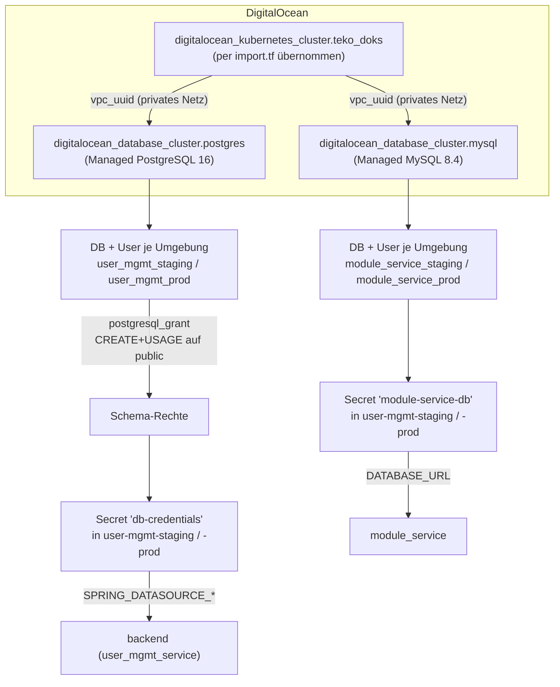

# Terraform – Infrastructure as Code (Aufgaben 3, 4, 6)

> **Modul:** Orchestrierung & Observability · **Aufgaben 3 (IaC), 4 (Managed
> PostgreSQL), 6 (module_service / Managed MySQL)**
> **Repository:** [`MikeGarda/vsc-ops`](https://github.com/MikeGarda/vsc-ops), Verzeichnis `terraform/`
> **Werkzeug:** [Terraform](https://www.terraform.io/) `>= 1.6.0` · Provider
> `digitalocean/digitalocean ~> 2.0`, `cyrilgdn/postgresql ~> 1.25`,
> `hashicorp/kubernetes ~> 2.0`

Kurzanleitung, wie die Infrastruktur des `user_mgmt_service` (DOKS-Cluster,
Managed PostgreSQL, Managed MySQL) per Terraform verwaltet wird und wie das
Setup lokal ausgeführt wird.

## 1. Zweck

Vor Aufgabe 3 wurde der Cluster manuell per `doctl` angelegt und die
Datenbank lief als Pod **im** Cluster. Terraform übernimmt jetzt:

- den **bestehenden** DOKS-Cluster per `import`-Block (keine Neuerstellung,
  kein Datenverlust),
- eine **Managed PostgreSQL**-Instanz für den `user_mgmt_service` (ersetzt
  den bisherigen DB-Pod),
- eine **Managed MySQL**-Instanz für den `module_service`,
- die Vergabe der DB-Zugangsdaten als **Kubernetes-Secrets** direkt aus dem
  Terraform-State heraus – Passwörter stehen weder im Git noch in einer
  Datei.

## 2. Dateien im Verzeichnis `terraform/`

| Datei | Zweck |
| --- | --- |
| `versions.tf` | Terraform- und Provider-Versionen, Provider-Konfiguration (`digitalocean`, `postgresql`, `kubernetes`) |
| `variables.tf` | Alle Eingabevariablen (Cluster, PostgreSQL, MySQL) inkl. Beschreibung und Validierung |
| `terraform.tfvars` | Nicht-geheime Werte (Region, Cluster-Name, Node-Grösse/-Anzahl, Cluster-ID, k8s-Version) |
| `main.tf` | Bereinigte Konfiguration des bestehenden DOKS-Clusters (`digitalocean_kubernetes_cluster.teko_doks`) |
| `import.tf` | `import`-Block, der den bereits per `doctl` erstellten Cluster in den State übernimmt |
| `generated.tf.raw` | Rohfassung aus `terraform plan -generate-config-out=` – nur zur Nachvollziehbarkeit, nicht aktiv genutzt |
| `database.tf` | Managed-PostgreSQL-Cluster + je eine DB/User pro Umgebung (`staging`, `prod`) + Schema-Rechte |
| `mysql.tf` | Managed-MySQL-Cluster + je eine DB/User pro Umgebung für den `module_service` |
| `secrets.tf` | Schreibt die DB-Zugangsdaten als `kubernetes_secret_v1` (`db-credentials`, `module-service-db`) in die Namespaces `user-mgmt-staging`/`user-mgmt-prod` |
| `outputs.tf` | Nicht-geheime Ausgaben zur Kontrolle (Hostnamen, Ports, DB-Namen – **keine** Passwörter) |
| `.terraform.lock.hcl` | Provider-Versions-Lockfile (wird committet) |

Nicht im Repo (per `.gitignore` ausgeschlossen): `terraform/.terraform/`,
`*.tfstate`, `*.tfstate.*`, `*.secret.tfvars`, `crash.log` – der State
(und damit auch die generierten Passwörter) verbleibt ausschliesslich lokal
bzw. im konfigurierten Backend.

## 3. Wie es zusammenhängt



- **Cluster-Import (Aufgabe 3):** `import.tf` übernimmt den bestehenden,
  per `doctl` erstellten Cluster über seine UUID (`var.cluster_id`) in den
  State, ohne ihn neu zu erstellen. Die Konfiguration in `main.tf` ist eine
  bereinigte Fassung des per `terraform plan -generate-config-out=` erzeugten
  `generated.tf.raw` (entfernte `null`-Werte, deaktivierte GPU/RDMA-Plugins,
  auto-vergebene Subnetz-UUIDs; korrigiert wurde `node_count` von `0` auf
  `var.node_count`, da ein `apply` sonst alle Worker-Nodes entfernt hätte).
- **Managed PostgreSQL (Aufgabe 4):** `database.tf` legt **eine** Instanz an
  und erzeugt darin je eine Datenbank + Benutzer pro Umgebung
  (`user_mgmt_staging`, `user_mgmt_prod`). Der `postgresql`-Provider
  verbindet sich als DO-Admin-User und vergibt `CREATE`+`USAGE` auf das
  Schema `public` (ab PostgreSQL 15 nötig, da neue Benutzer sonst keine
  Tabellen für Hibernate/`ddl-auto=update` anlegen dürfen). Die Instanz hängt
  am selben VPC wie der Cluster (`private_network_uuid`), die Verbindung
  läuft also nie über das öffentliche Internet.
- **Managed MySQL (Aufgabe 6):** `mysql.tf` funktioniert analog, aber
  ausschliesslich für den `module_service`. Der `user_mgmt_service` erhält
  dieses Secret **nie** – er spricht den `module_service` nur über dessen
  REST-API an, nicht direkt über die Datenbank.
- **Secrets (Aufgabe 4 + 6):** `secrets.tf` schreibt die Zugangsdaten direkt
  aus den Terraform-Ressourcen in `kubernetes_secret_v1`-Objekte
  (`db-credentials`, `module-service-db`) in die Namespaces
  `user-mgmt-staging`/`user-mgmt-prod`. Passwörter existieren damit nur im
  (gitignorten) State und im jeweiligen Cluster-Secret – nie im Repo.
- **Outputs:** `outputs.tf` gibt zur Kontrolle nur unkritische Werte aus
  (private Hostnamen, Ports, DB-Namen je Umgebung).

## 4. Verwendung

### 4.1 Voraussetzungen

- Terraform `>= 1.6.0` installiert
- DigitalOcean-API-Token mit Schreibrechten
- `kubectl`-Zugriff auf den Cluster (für den `kubernetes`-Provider, der über
  die Daten des importierten Clusters authentifiziert)

### 4.2 Token setzen (nie im Repo!)

```bash
# Linux/macOS
export TF_VAR_do_token="<dein-digitalocean-token>"

# PowerShell
$env:TF_VAR_do_token = "<dein-digitalocean-token>"
```

### 4.3 Init, Plan, Apply

```bash
cd terraform
terraform init
terraform plan     # bei Erstlauf: "1 to import, 0 to add, 0 to change, 0 to destroy"
terraform apply
```

Nicht-geheime Werte (Region, Cluster-Name, Node-Grösse/-Anzahl, DB-Grössen
und -Versionen) stehen bereits in `terraform.tfvars` und werden automatisch
eingelesen; sie müssen nur angepasst werden, falls sich die Zielumgebung
ändert.

### 4.4 Ergebnisse einsehen

```bash
terraform output                 # unkritische Werte (Hostnamen, Ports, DB-Namen)
kubectl get secret db-credentials -n user-mgmt-staging
kubectl get secret module-service-db -n user-mgmt-staging
```

## 5. Verifikation

```bash
# State enthält den importierten Cluster + beide Managed-DB-Instanzen
terraform state list

# Kein Drift zur echten Infrastruktur
terraform plan   # erwartet: "No changes."

# Secrets sind im Cluster angekommen (Werte werden nicht ausgegeben)
kubectl get secrets -n user-mgmt-staging | grep -E "db-credentials|module-service-db"
kubectl get secrets -n user-mgmt-prod    | grep -E "db-credentials|module-service-db"
```
